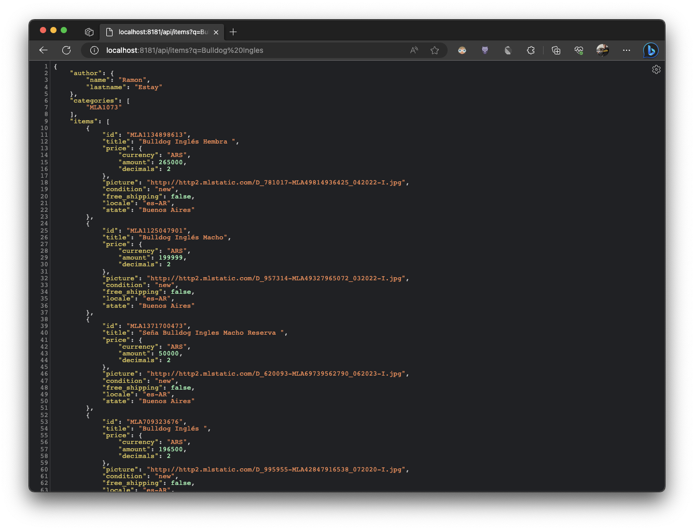
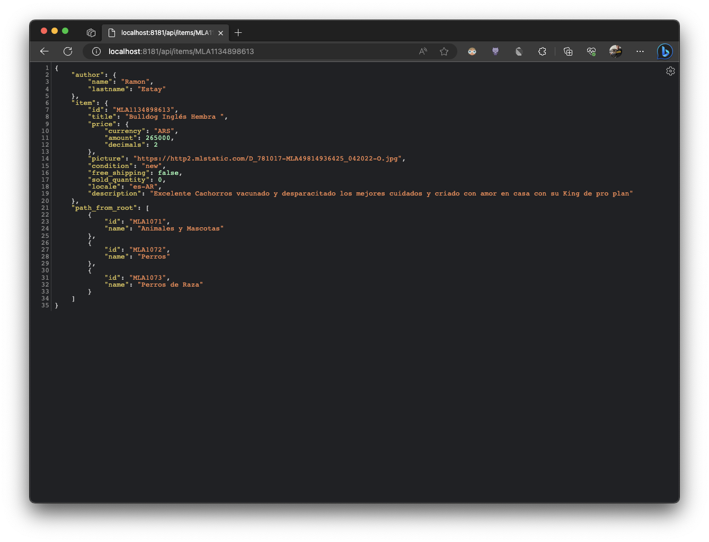

# MELI BFF

Este proyecto permite realizar la orquestacion de servicios hacia la api de MELI.

***Para mayor información https://developers.mercadolibre.com/***

## Como ejecutar

En el directorio "src" del proyecto debes ejecutar:

### `node index`

Esto levanta un servidor en node [http://localhost:8181](http://localhost:8181) que permite recibir las solicitudes desde la aplicacion web.

**Nota: La aplicación la puedes descargar desde [acá](https://github.com/ramonchop/meli_reactjs)**

## Endpoints

#### Buscar productos

El siguiente endpoint nos permite buscar productos

http://localhost:8181/api/items?q={query}

Por ejemplo quiero buscar un **Bulldog Ingles**

#

#### Detalle de producto

Este endpoint nos permite obtener información del producto por ID

http://localhost:8181/api/items/{id}

Por ejemplo quiero ver información de un producto.

